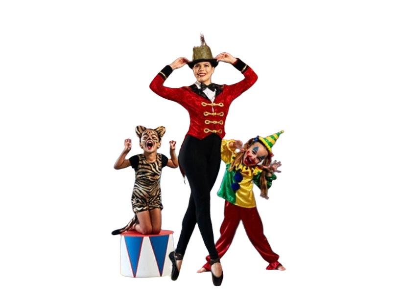

# 🖼️ BackgroundRemover – AI-Powered Background Removal Tool

**BackgroundRemover** is an AI-powered tool that makes it easy to erase image backgrounds with precision—no design skills or complex software needed. Built for creatives, small businesses, and everyday users, it uses deep learning to instantly detect and separate objects from their backgrounds.

---

## 🔗 Samples & Screen Recordings

> Click the thumbnail to view the recording.

<table>
    <tbody>
        <tr>
            <td>
                
            </td>
            <td>
                
            </td>
            <td>
                
            </td>
        </tr>
        <tr>
            <td>
                
            </td>
            <td>
                
            </td>
            <td>
                
            </td>
        </tr>
        <tr>
            <td>
                
            </td>
            <td>
                
            </td>
            <td>
                
            </td>
        </tr>
        <tr>
            <td></td>
            <td>
                <video src="https://github.com/user-attachments/assets/4b1038c2-7339-448a-88ae-b8b5a6bf6149" controls preload>
                    Your browser does not support the video tag.
                </video>
            </td>
            <td></td>
        </tr>
    </tbody>
</table>

---

## 📝 Overview

BackgroundRemover streamlines background removal from images using **deep learning**. Designed for:

- Graphic designers
- Photographers
- Content creators
- Small businesses

**Key benefits:**

- Removes backgrounds in under a second
- No design or technical skills required
- API-based access for integration

---

## ⚠️ Problem

Manual background removal is time-consuming, costly, and often requires advanced software. Existing tools are either:

- Expensive
- Complex
- Require manual intervention

This creates a barrier for small creators, entrepreneurs, and photographers who need fast, precise results.

---

## 💡 Solution

BackgroundRemover leverages **U-Net-based convolutional neural networks** for accurate object-background separation. Users send images to an **API endpoint** and receive processed images instantly.

**Key features:**

- High precision background removal
- Cloud-based API for accessibility
- Fast processing (<1 second per image)

---

## 🛠️ Process

### 1️⃣ Data Collection & Preprocessing
- Gathered large dataset of annotated images
- Applied augmentation (rotation, scaling)

### 2️⃣ Model Architecture
- **U-Net** for semantic segmentation
- Encoder-decoder structure with skip connections

### 3️⃣ Model Training
- Training using SGD and binary cross-entropy
- Batch normalization and dropout for generalization

### 4️⃣ Post-processing & Refinement
- Morphological operations (dilation, erosion)
- Hyperparameter tuning for better performance

### 5️⃣ API Deployment
- Docker-based cloud deployment
- RESTful API for image submission and return

---

## 🏆 Achievements

- ✅ **Accuracy:** 95%+ on diverse datasets
- ✅ **Processing speed:** <1 second per image
- ✅ **Scalable API** for multiple users
- ✅ **Generalization:** Handles complex scenes
- ✅ **Resource efficiency:** Low server usage

---

## 🔮 Future Improvements

1. Advanced semantic segmentation for fine details
2. Real-time video background removal
3. User-friendly GUI for broader adoption
4. Multi-language API support
5. Parallel/GPU processing for batch images
6. Fine-tuning options for users
7. Video foreground-background separation
8. Integration with design and editing tools
9. Automatic object recognition and labeling
10. Transfer learning for domain-specific adaptation

---

## 📚 References

1. [U-Net: Convolutional Networks for Biomedical Image Segmentation](https://arxiv.org/abs/1505.04597) – Olaf Ronneberger et al.
2. [Deep Residual Learning for Image Recognition](https://arxiv.org/abs/1512.03385) – Kaiming He et al.
3. [Batch Normalization](https://arxiv.org/abs/1502.03167) – Sergey Ioffe & Christian Szegedy
4. [Dropout: A Simple Way to Prevent Neural Networks from Overfitting](http://www.cs.toronto.edu/~hinton/absps/JMLRdropout.pdf) – Nitish Srivastava et al.
5. [RESTful Web Services](https://www.ics.uci.edu/~fielding/pubs/dissertation/rest_arch_style.htm) – Roy Thomas Fielding
6. [Docker: Lightweight Linux Containers](https://www.docker.com/what-docker) – Docker Inc.
7. [Stochastic Gradient Descent](https://www.deeplearningbook.org/contents/optimization.html) – Ian Goodfellow et al.
8. [Morphological Image Processing](https://en.wikipedia.org/wiki/Mathematical_morphology) – Wikipedia
9. [Image Segmentation with a U-Net-Like Architecture](https://www.jmlr.org/papers/volume20/18-310/18-310.pdf) – Alexander Vaiserman et al.  
